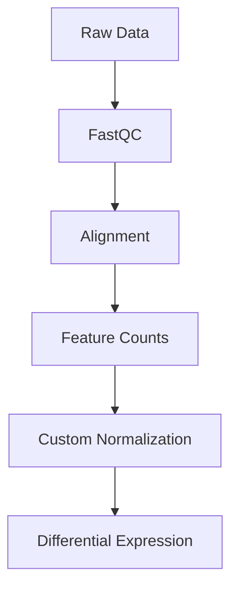

# Custom Scripts System

The FlowAgent custom scripts system allows you to integrate your own analysis scripts into the workflow. This powerful feature enables you to:

- Add custom analysis steps in any programming language
- Integrate seamlessly with standard workflow steps
- Maintain flexibility and extensibility in your workflows

## Overview

The custom scripts system is designed to be:

- **Language Agnostic**: Support for R, Python, Bash, and other languages
- **Self-Documenting**: Clear metadata structure for each script
- **Workflow-Aware**: Scripts specify their position in the workflow
- **Dependency-Aware**: Automatic validation of required packages

## Directory Structure

```
flowagent/
├── custom_scripts/
│   ├── rna_seq/           # RNA-seq specific scripts
│   │   └── normalization/
│   │       ├── custom_normalize.R
│   │       └── metadata.json
│   ├── chip_seq/          # ChIP-seq specific scripts
│   │   └── peak_analysis/
│   │       ├── custom_peaks.py
│   │       └── metadata.json
│   └── common/            # Scripts usable across workflows
       └── utils/
           ├── data_cleanup.sh
           └── metadata.json
```

## Integration with Workflows

Custom scripts are automatically:

1. **Discovered** by scanning the custom_scripts directory
2. **Validated** by checking required dependencies
3. **Integrated** into workflows based on their metadata
4. **Executed** in the proper order with correct inputs/outputs

## Example Workflow

Here's how a custom normalization script integrates into the RNA-seq workflow:



## Next Steps

- [Adding Scripts](adding-scripts.md): Learn how to add your own custom scripts
- [Script Requirements](requirements.md): Understand the requirements for custom scripts
- [Examples](examples/): See example implementations in different languages
